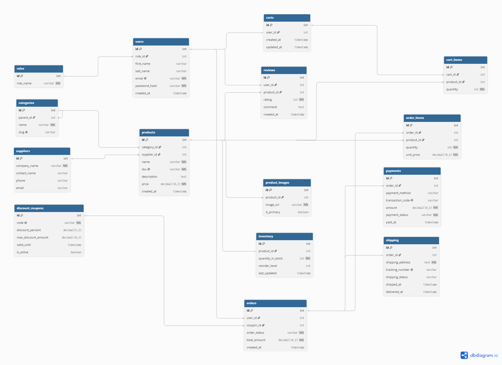

# E-Commerce Database

PostgreSQL database for an e-commerce platform.

## Files
- **schema.sql** – Creates all tables and constraints
- **data.sql** – Inserts sample data
- **logic.sql** – Trigger & stored procedure for payments
- **queries.sql** – Advanced queries (CTEs, window functions, recursion)

## How to Run
Run the files in order inside pgAdmin:

1. `schema.sql`
2. `data.sql`
3. `logic.sql`
4. `queries.sql`

## Tech
PostgreSQL / pgAdmin 4
